# 캐나다 산불 기상지수를 이용한 산불발생확률모형 개발
## - 강원도 지역 산불발생을 중심으로 -

* **저자**: 박흥석 (동국대학교), 이시영 (강원대학교 - 교신저자), 채희문 (한국기후변화대응연구센터), 이우균 (고려대학교)
* **학회지**: 한국방재학회논문집, 제9권 3호, 2009년 6월 (pp. 95 ~ 100)
* **분야**: 소방방재

---

## 요지 (Abstract)
캐나다의 산불 위험등급 시스템의 구성요소인 미세연료수분지수(FFMC, Fine Fuel Moisture Code)는 지상의 미세 연료의 건조 여부의 예측을 통해 산불의 발화 위험성을 지시하는 지수이다. 본 연구에서는 5년간의 강원도 지역에서의 기상 자료를 분석하고, 이를 이용하여 미세연료수분지수를 산출하여, 그 연중 분포와 적용성을 검토하였다.

분석 결과, 강원도 지역의 기후 조건은 봄철과 가을철 산불 조심 강조기간에 아주 적은 강수량과 낮은 습도를 보여주고 있으며, 지난 5년간의 발생한 산불 중 75%가 산불 조심 강조기간에 발생하였으며, 그 중 90%가 봄철 산불조심기간에 집중되어 있었다. 또한, 봄철 산불조심 강조기간을 대상으로 순기 평균 산불연료지수에 대한 로지스틱 분석 결과 약 63%의 판별율을 나타내었다. 하지만, 모형의 정확도 향상을 위한 기상 자료의 보다 정확한 지역간 분류가 필요할 것으로 판단된다.

**핵심용어**: 연료 수분 지수(FFMC), 캐나다 산불 위험 지수(CFFDRS), 산불 발생

---

## 1. 서론

### 1.1 연구배경 및 목적
우리나라는 산림이 전국토의 65%를 차지하고 있어 산불의 영향을 받기 쉬우며, 1970년대의 산림 녹화 사업과 강력한 산불 금지 정책으로 산림 내에 연료가 증가하여 산불의 발생과 대형화 가능성이 높아지고 있다.(이시영 등, 2001) 그 결과, 1990년대 들어 산불 발생 건수가 지속적으로 증가하고 있으며, 그 규모 또한 대형화 되고 있다.(최관 등, 1996) 이러한 산불은 생태계의 주요 교란 요인 중 하나로서, 산불로 인해 수목의 소실로 인한 직접적인 임산 자원 손실뿐만 아니라 토양 유출과 이로 인한 산사태 피해, 수자원 부족, 산림 생산량 감소와 서식종의 감소로 이어진다. 아울러 생태계 파괴와 경관 파괴로 인한 관광 수요의 감소 등 2차적인 피해를 야기시키고 있다.

최근 지구 온난화로 인한 임상의 변화와 이로 인한 산불 발생 가능성의 변화가 예상되고 있으며, 가뭄 기간의 연장(임종환 등, 2006)과 이로 인한 지상 연료의 발화 가능성 변화도 예상되고 있다. 또한, 기후 변화로 인한 강풍 발생에 의해, 산불의 대형화 가능성이 높아지고 있고, 지구 온난화와 기후 변화로 인한 산불의 피해는 증가할 것으로 예측하고 있다.(Stocks 등, 1998) 이로 인해 선진국에서는 전 국가적인 산불 관리 정책의 개선과 관심을 촉구하고 있으며, 이를 위해 기후 변화로 인해 산불에 미치는 영향에 대한 연구가 증가하고 있는 추세이다.(Flannigan 등, 2005; Stocks, 2000) 따라서, 이러한 기후 변화에 따른 산불 발생 가능성의 변화를 파악하고, 예측함으로써, 산불의 대형화를 미연에 방지하는 기술의 개발과 적용이 더욱 필요하다고 할 수 있다.

이러한 기후 변화로 인해 다가올 미래의 기상 조건은, 여지껏 한반도에서 경험하지 못한 새로운 기상 환경을 제공할 것으로 예측되며, 이는 강우량의 급격한 증가와 집중호우, 비정상적인 가뭄 시기의 증가와 이로 인한 한반도의 산림 식생의 변화를 가져올 것으로 예측된다.(임종환 등, 2006; 한국환경정책평가연구원, 2005) 이러한 산불 환경의 변화는 산불의 발생 빈도와 대형화 가능성의 변화를 가져올 것이 필연적인 상황이지만, 현재 우리나라에서 운영 중인 산불 예보 시스템의 발생 예측 모형은 과거의 산불 발생 자료와 단기간의 기상 자료를 이용한 확률적 모형에 근거함으로써, 미래의 변화된 기상 환경에 적용성에 대한 문제점이 예상되고 있다.

그러므로, 보다 정확한 산불의 발생 예측을 위해서는 산불 발생 인자 별로 세분화된 접근이 필요할 것으로 사료된다. 자연 발화가 산불 발생 원인 중 대부분을 차지하는 미국과 캐나다 등과는 달리, 우리나라의 산불 발생은 담뱃불로 인한 실화, 논·밭두렁 태우기, 쓰레기 소각과 같은 인위적인 원인으로 인한 불씨가 지상의 연료 건조 정도와 강한 바람에 산불로 발전하는 경우가 대부분이다.(이시영 등, 2001)

따라서 본 연구에서는 우리나라의 대표적인 산림 지대이며, 산불의 가장 많은 피해를 보았던 강원도를 대상으로 지난 5년간의 기상 자료와 산불 발생 자료를 바탕으로 산불 발생과 기상관계를 분석하고, 캐나다 산림청에서 개발한 미세연료수분지수(FFMC, Fine Fuel Moisture Code)의 적용성 검토를 위해 FFMC와 강원도에서의 산불 발생 간의 상관 관계를 분석하고, FFMC의 직접적인 적용 가능성을 시험하고, 이를 이용한 산불 발생 예측 확률 모형을 개발하고자 한다.

---

## 2. 연구 방법

### 2.1 연구 대상지
연구 대상지는 강원도 지역을 대상으로 하였다. 강원도는 우리나라 전역의 산불 중 특히 봄철에 집중적으로 대형 산불이 발생하는 경향이 있으며,(원명수 등, 2006) 이는 영동지역 특유의 건조하고 강한 바람이 대형 산불의 발생 원인이 되고 있다.(이시영 등, 2001) 따라서, 지상 미세 연료의 수분량 변화와 산불의 발생 추이의 파악에 적합한 지역으로 사료 되었으며, 산불 발생 자료 분석 결과, 지난 10년(1999~2008년)간 전국에서 발생한 산불 피해 면적 중 약 74%를 차지한 지역이므로, 산불의 피해 영향을 많이 받은 지역으로 판단되어 대상지로 선정하였다.

### 2.2 분석 방법

#### 2.2.1 캐나다 산불 기상지수(FWI)의 소개
본 연구에서 적용성이 검토되는 FFMC는 현재 캐나다에서 사용하고 있는 캐나다 산불위험 평가시스템(CFFDRS, Canadian Forest Fire Danger Rating System)의 구성 요소인 FWI(Fire Weather Index)를 구성하는 기본 입력 자료이다. 이것은 현재까지 계속적인 보완연구를 거듭하고 있고, 개발된 프로그램은 캐나다 전 지역에서 현재 산불예방 및 진화 등에 활용되고 있다.(Van Wagner, 1987)

FWI 시스템은 3가지 종류의 연료의 습도 변화를 나타내는 지수와 이를 이용하여 바람의 영향을 고려하여 산정된 ISI(Initial Spread Index), 그리고 BUI(Build Up Index)의 5가지의 구성요소로 되어 있다. 첫 번째 3개의 구성요소는 본 연구에 적용될 연료에 포함된 습도코드로서, 지상의 임내 미세 연료의 수분량을 지수화하여 예측하는 **미세연료수분지수(FFMC)**와 임내의 표층 연료 층의 습도를 예측하는 **Duff Moisture Code(DMC)** 그리고 깊은 유기물층과 지중의 굵은 연료의 수분을 예측함으로써 계절적인 가뭄과 지중화의 가능성을 예측하는 **Drought Code(DC)**로 구성된다.

그 중 FFMC는 풍속 인자와 결합되어 초기 확산 지수(ISI)를 산출하기 때문에 그 중요성은 매우 크다고 할 수 있다. 이러한 FFMC는 기온과 상대습도, 풍속, 강수량을 이용하여 얻어지며, 0~99까지의 수로 나타내어진다. 숫자가 높을 수록 지상의 가는 연료의 수분 함유량이 적으므로 발화 가능성이 높다고 할 수 있으며,(Alexander 등, 1996) 이를 이용하여 반대로 $0.25 \text{ kg/m}^2$의 미세 연료가 함유하고 있는 수분량을 추정할 수도 있다. 미세 연료의 수분량을 이용하여 미세 연료 수분 지수를 계산하는 방법은 식 (1)과 같다.

$$\text{F} = \frac{59.5(250 - m)}{147.2 + m} \qquad (1)$$

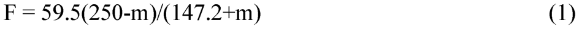

여기서, $F$는 미세연료수분지수(FFMC)이며 $m$은 미세연료가 함유하고 있는 최소 수분량이다. 또한, 최소 수분량 $m$은 전일의 최소수분량에서 변화하게 되며, 이 둘은 다음 식 (2)와 같은 관계를 갖는다.

표준 FFMC 계산에서는 먼저 전일 FFMC($F_0$)를 전일 미세연료 수분량($m_0$)으로 변환한다.

$$m_0 = \frac{147.2(101 - F_0)}{59.5 + F_0} \qquad (2)$$

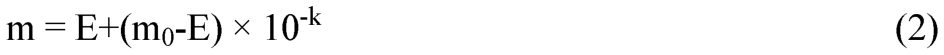

* $m$: 당일 미세연료 수분량
* $m_0$: 전일 미세연료 수분량
* $F_0$: 전일 미세연료수분지수(FFMC)
* $k_d, k_w$: 건조율 및 습윤율
* $E$: 당일의 평형 수분량(equilibrium moisture contents)
* $r_0$: 관측 강수량(mm)

강수량이 0.5 mm를 초과할 경우, 당일의 건조/습윤 과정이 시작되기 전에 강수에 의한 미세연료 수분 증가를 먼저 반영한다. 순강수량($r_f$)은 식 (3)과 같이 계산한다.

$$r_f = r_0 - 0.5 \qquad (3)$$

$r_0 \le 0.5$이면 강수 보정은 적용하지 않고 $m_r = m_0$로 둔다. $r_0 > 0.5$이면 강수로 인한 수분 증가량($\Delta m$)을 식 (4)와 같이 계산한다.

$$\Delta m = 42.5 r_f e^{\frac{-100}{251 - m_0}} \left(1 - e^{\frac{-6.93}{r_f}}\right) \qquad (4)$$

다만 초기 수분량이 높은 경우($m_0 > 150$)에는 강수 효과의 비정상적 거동을 보정하기 위해 식 (5)의 보정항을 추가한다.

$$\Delta m = \Delta m + 0.0015(m_0 - 150)^2 r_f^{0.5} \qquad (5)$$

강수 보정 후의 수분량($m_r$)은 다음과 같이 계산하며, 최대값은 250으로 제한한다.

$$m_r = \min(m_0 + \Delta m,\ 250) \qquad (6)$$

이후 평형수분량 $E$는 당일의 상대습도($H$)와 온도($T$)의 식으로 산출된다. 이 평형 수분량 $E$는 수분이 증발하는 건조 상황($E_d$)과 수분을 흡수하는 습윤 상황($E_w$)에 따라 다르게 계산된다.

$$\text{건조 시 평형수분량 } E_d = 0.942 H^{0.679} + 11 e^{\frac{H-100}{10}} + 0.18(21.1 - T)(1 - e^{-0.115 H}) \qquad (7\text{a})$$
$$\text{습윤 시 평형수분량 } E_w = 0.618 H^{0.753} + 10 e^{\frac{H-100}{10}} + 0.18(21.1 - T)(1 - e^{-0.115 H}) \qquad (7\text{b})$$

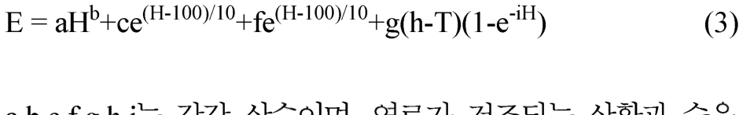

여기서 연료가 건조되는 상황과 습윤해지는 상황에 따라 수분 변화식에 쓰일 수정 건조율 $k_d$ 또는 수정 습윤율 $k_w$이 결정된다. 한편, 기준 온도(21.1℃)에서의 기본 로그 건조율 $k_0$와 기본 로그 습윤율 $k_{w0}$는 평균 풍속($W$, km/h)과 상대 습도($H$)에 의해 아래 공식 (8a), (8b)와 같이 산출되며, 최종 지수에 들어갈 건조율/습윤율 $k_d$, $k_w$는 기온($T$, ℃)에 따른 온도 보정 계수(식 9)를 곱하여 최종 산정한다.

$$\text{기본 건조율 } k_0 = 0.424 \left[ 1 - \left( \frac{H}{100} \right)^{1.7} \right] + 0.0694 W^{0.5} \left[ 1 - \left( \frac{H}{100} \right)^8 \right] \qquad (8\text{a})$$
$$\text{기본 습윤율 } k_{w0} = 0.424 \left[ 1 - \left( \frac{100 - H}{100} \right)^{1.7} \right] + 0.0694 W^{0.5} \left[ 1 - \left( \frac{100 - H}{100} \right)^8 \right] \qquad (8\text{b})$$

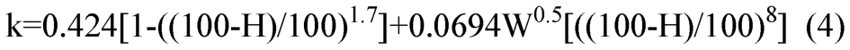

$$k_d \text{ 또는 } k_w = (k_0 \text{ 또는 } k_{w0}) \times 0.581 e^{0.0365 T} \qquad (9)$$

이와 같이 강수 보정 후 수분량($m_r$), 평형수분량($E_d$, $E_w$), 최종 수정 건조율/습윤율($k_d$, $k_w$)을 이용하여 당일의 미세연료수분량($m$)을 산출한다.
* 강수 보정 후 수분량 $m_r$가 건조평형수분량 $E_d$보다 크면 ($m_r > E_d$) 건조 과정이 진행된다:
  $$m = E_d + (m_r - E_d) \times 10^{-k_d} \qquad (10\text{a})$$
* 강수 보정 후 수분량 $m_r$가 습윤평형수분량 $E_w$보다 작으면 ($m_r < E_w$) 습윤 과정이 진행된다:
  $$m = E_w - (E_w - m_r) \times 10^{-k_w} \qquad (10\text{b})$$
* 그 외의 경우 ($E_w \le m_r \le E_d$)에는 수분량이 유지된다: $m = m_r$.

최종적으로 식 (10)을 통해 얻어지는 당일의 미세연료 수분량($m$)을 식 (1)에 대입하여 미세연료수분지수(FFMC)를 구하게 된다. 이와 같은 계산은 J.A. Turner와 Van Wagner의 실험에 의해 입증된 계산식을 이용한 것이다.(Van Wagner, 1987)

> [!NOTE]
> ### 🔍 [학술적 분석] 본 논문의 수식 (2), (3), (4) 기재 상태와 표준 공식(Van Wagner, 1987)과의 대조 요약
>
> 이 논문 본문에 인쇄된 원본 수식 이미지(`eq_3_2.png`, `eq_3_3.png`, `eq_3_4.png`)는 계산식의 단순화 과정에서 캐나다 산림청 표준 공식(Van Wagner, 1987)과 비교했을 때 아래와 같은 중대한 수식 기재 축약(오타)을 포함하고 있습니다.
>
> 1. **전일 FFMC의 내부 수분량 변환식 생략**: 논문 인쇄본은 전일 FFMC($F_0$)로부터 전일 미세연료 수분량($m_0$)을 유도하는 역변환식이 본문 흐름에서 명확히 드러나지 않습니다. 실제 표준 계산에서는 식 (2)를 통해 $m_0$를 먼저 계산한 뒤 다음 단계로 진행합니다.
> 2. **강수 보정 단계의 별도 처리 필요**: 강수량이 0.5 mm를 초과할 경우에는 건조/습윤 과정 전에 강수 보정식(식 3~6)을 먼저 적용해야 합니다. 이 단계가 빠지면 비가 온 날의 FFMC가 표준 계산보다 과대평가될 수 있습니다.
> 3. **온도 보정 계수의 명시 필요**: 수정 건조율/습윤율 보정에는 온도 보정식(식 9: $0.581 e^{0.0365 T}$)이 필요합니다. 실제 표준 공식에서는 $k_d = k_0 \times 0.581 e^{0.0365 T}$ 또는 $k_w = k_{w0} \times 0.581 e^{0.0365 T}$를 수분 변화식에 적용해야 합니다.
> 4. **평형수분량(EMC)의 건조/습윤 분기 필요**: 건조 상황($E_d$)과 습윤 상황($E_w$)에 따라 다르게 작용하는 별개의 공식(7a)과 (7b)를 구분해야 합니다.
> 5. **건조율/습윤율 공식의 분기 필요**: 건조 과정에는 $H/100$ 계열의 기본 건조율(8a)을, 습윤 과정에는 $(100-H)/100$ 계열의 기본 습윤율(8b)을 적용해야 합니다.
> 6. **보유 기상 데이터 기반 재현 가능성 검증**:
>    - 본 논문 및 Van Wagner(1987) 표준 모형에서 미세연료수분지수(FFMC)를 산출하는 데 필요한 입력 변수는 **기온($T$, ℃), 상대습도($H$, %), 풍속($W$, km/h), 강수량($r_0$, mm)** 4가지의 기상 인자뿐입니다.
>    - 공식 내에 등장하는 '연료 수분량($m$)' 등의 인자는 측정치가 아니라 전날의 FFMC 지수($F_0$)로부터 재귀적으로 유도해내는 내부 상태 변수(State Variable)입니다.
>    - 따라서, 현재 프로젝트에 구비된 `학습데이터_최종.csv` 및 `강원도날씨_격자_일단위/시간단위.csv` 등의 기상 시계열 데이터만으로도 표준 FFMC 공식을 재현하고 계산할 수 있습니다. (연료에 대한 실측 데이터가 없어도 계산에 전혀 지장이 없습니다.)
>
> 실무적인 산불 모형 재현 시에는 논문 인쇄본의 축약식 대신 위에 기술한 **표준 공식 (2)~(10) 세트**를 순서대로 적용해야 올바른 FFMC 지수가 계산됩니다.

#### 2.2.2 캐나다 산불 기상지수의 적용 및 분석 방법

##### 2.2.2.1 기상 자료
산불 기상지수의 산출을 위한 필수 입력 자료는 최고 온도, 평균 습도, 최대 습도, 최대 풍속, 강수량이다. 금번 연구에서는 기상청의 협조를 받아 강원도의 속초, 철원, 대관령, 춘천, 강릉 관측소의 기상자료를 사용하였으며, 관측 시기는 2002년부터 2006년까지의 5년간 자료를 이용하였다.

##### 2.2.2.2 산불 발생자료
산불 발생자료는 2002년부터 2006년까지의 산림청 산불 통계 자료를 참조로 하였으며, 연구기간 동안 발생한 산불 발생 사례 중 강원도 지역만을 선택하여 날짜 순으로 배열하였다. 산불 발생과 기상 인자 간의 분석을 위하여 산불 발생을 1, 산불 미발생 시 0으로 각각 입력하여 FWI에서 산출된 FFMC의 산출 결과와 비교 분석하였다.

##### 2.2.2.3 FFMC의 산출
위의 기상 자료를 입력하여 산불 기상지수(FWI)를 통해 산출된 미세 연료 수분 지수(FFMC)를 사용하여, 산불 자료와의 상관관계 분석을 실시하였다. 산불 기상지수는 0~99까지의 수로 나타내어지며, 그 수가 클수록 산불의 발생 확률이 높다고 할 수 .

##### 2.2.2.4 분석 방법
조사된 자료는 SPSS 12.0.1 프로그램을 사용하여 통계 분석을 실시하였다. 산불의 발생을 추정하기 위한 추계 통계학(inferential statistic)적 방법으로 가장 많이 쓰이는 것은 로지스틱 분석법이다. 로지스틱 분석에 대한 가설을 위해, 미세연료수분지수(FFMC)와 산불 발생에 대해 상관관계 분석과 로지스틱 분석을 실시하였다.

---

## 3. 연구 결과

### 3.1 기상 조건 분석 결과
강원도 지역의 5개 관측소(속초, 철원, 대관령, 춘천, 강릉)에서 2002년부터 2006년까지 측정된 5년간의 기상자료를 분석한 결과, 연평균 기온은 15.9℃, 일일 최고기온은 30.7℃, 일일 최저기온은 -1.9℃를 기록하였고, 연평균 강수량은 1700 mm, 일일 최고 강수량은 386.2 mm, 연평균 풍속은 2.54 m/s, 연평균 습도는 66.5%로 나타났다. 강원도 지역의 5년 간 기상 자료 중 기온과 강수량을 월별 추세로 분석해 보면 기온과 강수는 7월, 8월에 집중적으로 높아지고 있음을 알 수 있다.

특히, 산림청에서 지정한 산불조심 강조기간(봄철: 2월 1일~5월 15일, 가을철: 11월 1일~12월 15일)의 기상 자료를 분석한 결과, 봄철 산불조심 강조기간의 평균 기온은 12℃, 일일 평균 강수량은 2.01 mm를 기록하였고, 가을철 산불조심 강조기간의 평균 기온은 8℃, 평균 강수량은 1.8 mm를 기록하였다. 산불조심 강조기간을 봄철, 가을철, 그리고 그 외의 기간으로 나누어 1년 단위로 기온 변화와 강수량 변화 추이를 나타내면 다음 Fig 2와 Fig 3과 같다. 이를 분석해보면, 기온은 하절기가 포함된 관계로 산불 강조기간이 아닌 시기가 가장 높은 것으로 나타났고, 가을철 산불 강조 기간이 가장 낮은 것으로 나타났다. 이는 기온이 산불의 발생 추이에 큰 영향을 주지 않는 것으로 판단된다. 하지만, 강수량은 봄철 산불조심 강조 기간과 가을철 산불 강조 기간이 각각 나머지 기간의 36%와 27%만을 차지할 정도로 건조한 것으로 나타났다.

산불조심 강조기간 중 조사 대상지인 강원도 지역에서 발생한 산불 중 90%가 봄철에 발생하였으므로, 봄철 산불 조심 강조기간의 FFMC 중 10일 단위의 평균 FFMC를 사용하였다. 산출된 순기별 FFMC에 의한 모형화를 위해 빈도 분석 결과에 의한 순기별 FFMC를 백분위 수에 의해 Table 1과 같이 4개 지수로 분류하여 지수화하였다. 이와 같은 조사 및 분석 방법은 다음 Fig 1과 같이 정리하였다. 이것은 Index가 낮으면, FFMC가 낮고, 미세 연료 내의 수분이 높음을 의미한다.

#### Table 1. Classification of mean FFMC during 10 years in spring
| FFMC | Index |
| :---: | :---: |
| 0-58 | 1 |
| 58.01-70.5 | 2 |
| 70.51-80 | 3 |
| 80.01-99 | 4 |

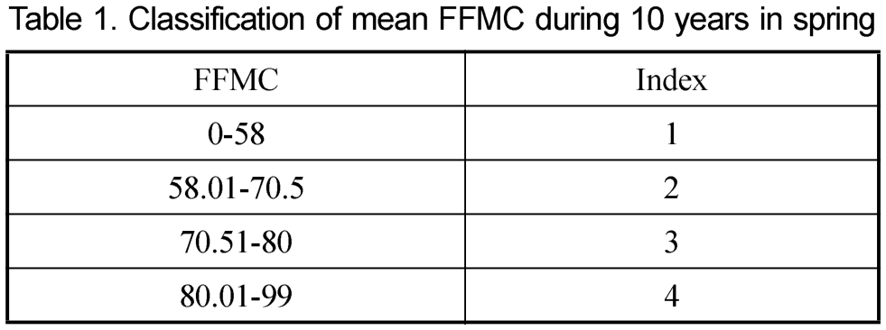

---

#### Fig 1. Flowchart of development of forest fire occurrence probability model
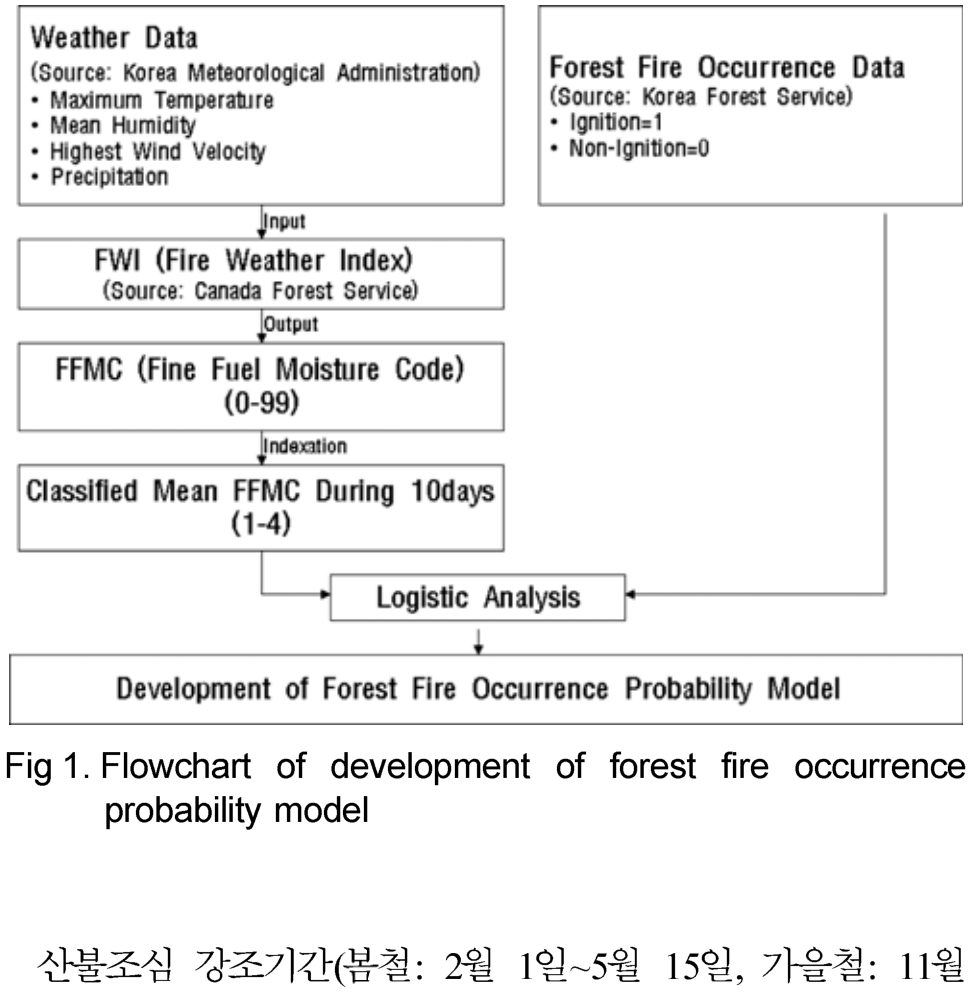

---

#### 기상 및 산불 발생의 시즌별 비교 분석 (Fig 2, Fig 3, Fig 4)

| Fig 2. 연도별 기온 비교 (Temperature) | Fig 3. 연도별 강수량 비교 (Precipitation) | Fig 4. 연도별 산불 발생 비교 (Fire Occurrence) |
| :---: | :---: | :---: |
| 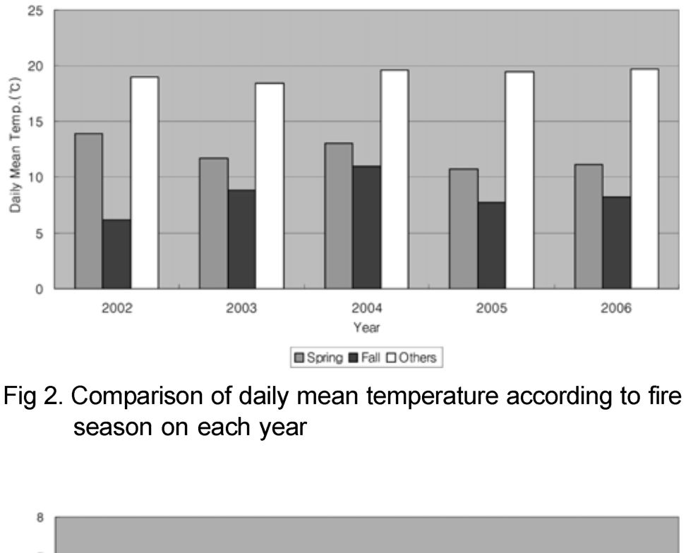 | 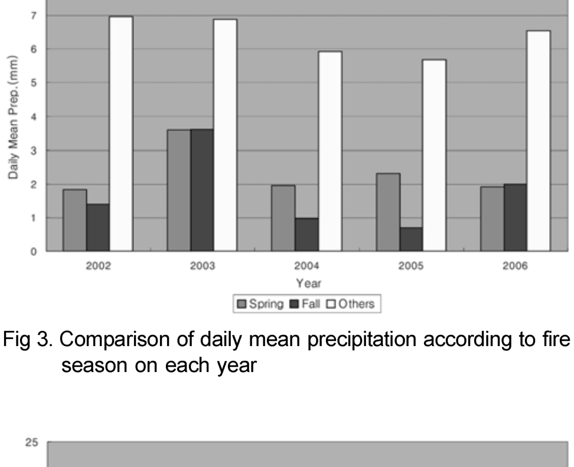 | 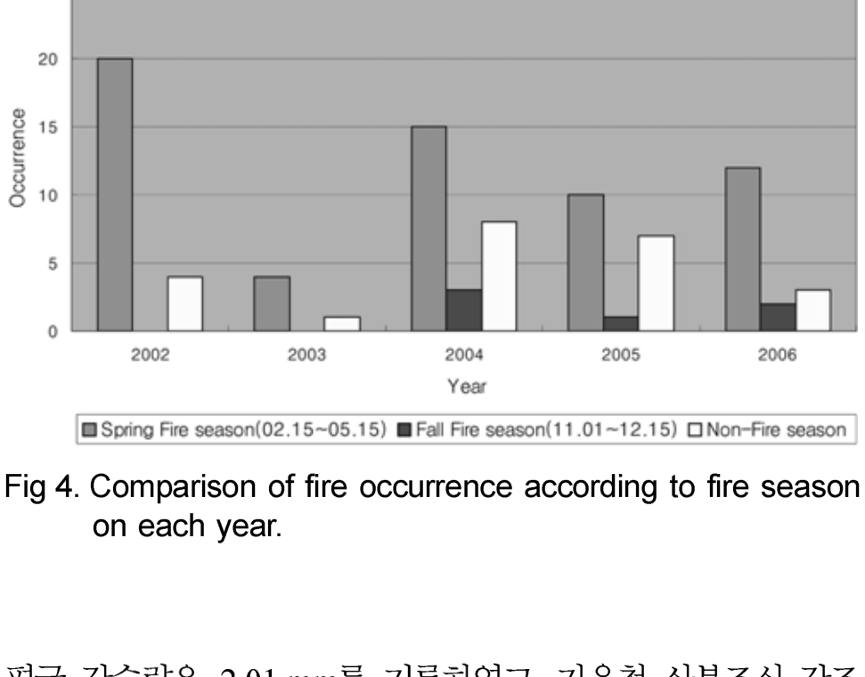 |

---

### 3.2 산불 지상 연료지수(FFMC)의 분석 결과
강원도 지역 전체의 평균 기상조건을 캐나다 산불 기상 지수(FWI)에 적용하여 산출한 연중 평균 FFMC의 추이는 Fig 5와 같다.
빈도 분석 결과 평균 64.58, 표준 편차 15로 나타났으며, 1년 중 7월, 8월을 제외하고 높은 수치를 나타내고 있다. 이는 7월, 8월에 집중 호우로 인한 강수량의 증가로 FFMC가 낮아진 것으로 사료되며, 나머지 기간동안의 FFMC가 70이상으로 높게 나타나고 있다. 이는 강원도 지역이 기후적 조건으로 인해 지상연료가 건조한 상태가 유지되어 산불의 위험성이 년 중 상존해 있는 지역이라 할 수 있다.

봄철과 가을철 산불 조심 강조기간의 FFMC를 비교한 결과는 다음 Fig 6과 같다. 산불조심 강조기간을 비교해보면, 2005년을 제외하고 봄철 산불조심 강조기간의 FFMC가 가을철 산불조심 강조기간의 FFMC보다 높은 것으로 나타났다. Fig 4의 산불 발생의 추세와 비교해보면, 봄철 산불조심 강조기간에 강원도에서 발생한 전체 산불의 68%가 발생한 것으로 나타났다. 이는 봄철 산불 조심 강조 기간이 비교적 높은 기온과 적은 강수량으로 인해 산불이 발생하기 쉬운 조건이 형성되었음을 알 수 있다. 반면, 비 산불조심강조기간에도 다수의 산불이 발생한 것으로 보아 기상조건 외에도 인위적인 영향도 큰 것으로 나타났다.

#### Fig 5. Daily mean FFMC during 5 years
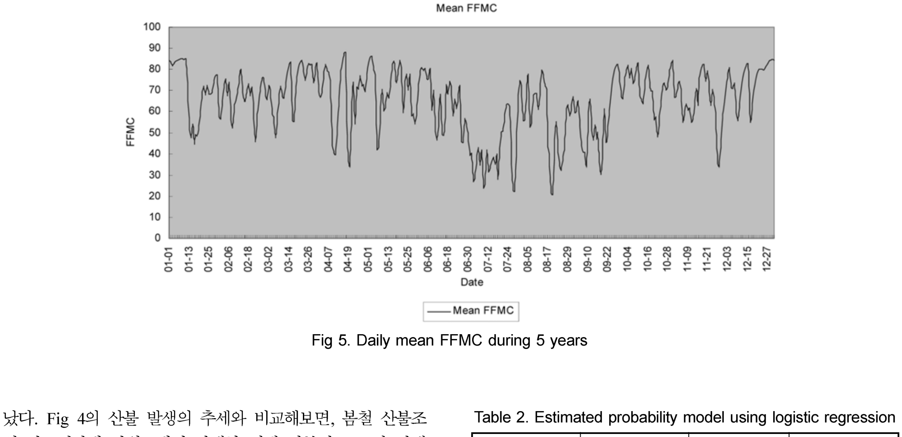

#### Fig 6. Mean FFMC during spring, and fall fire season and others
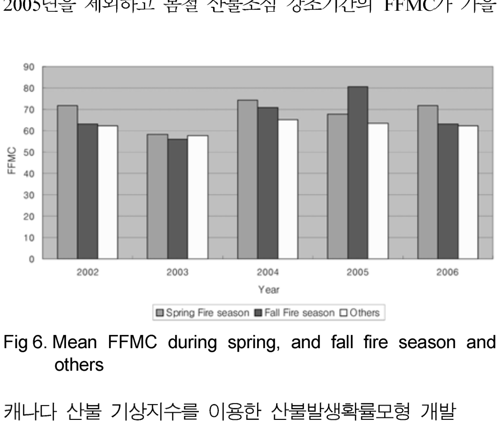

---

### 3.3 통계 분석 결과
조사 대상 지역인 강원도 지역의 5개 관측소의 2002년부터 2006년 까지의 봄철 산불조심 기간의 순기별 평균 FFMC와 산불 발생의 유무를 SPSS 12.0.1을 사용하여 로지스틱 회귀 분석(logistic regression)을 실시한 결과, 식 (1)과 (2)의 산불발생확률($P$)을 예측하는 모형식을 개발하였다.

$$\frac{P}{1 - P} = e^{-0.529 + 0.421 \times INDEX} \qquad (1)$$

$$P = \frac{e^{-0.529 + 0.421 \times INDEX}}{1 + e^{-0.529 + 0.421 \times INDEX}} \qquad (2)$$

* **INDEX**: 지수화된 FFMC (Table 1의 분류 코드 1~4)

여기에서 $P$는 산불 발생 확률이며 INDEX는 지수화된 FFMC이다. 지수화된 FFMC는 산불 발생과 5% 수준에서 통계적인 유의성을 갖는 것으로 나타났다. 즉, 지수화된 FFMC가 높을수록 산불 발생 위험이 증가하는 것으로 나타났다. 추정 모형의 적합도는 -2LogLikelihood(-2LL)과 분류 정확도로 평가할 수 있는데, 분류 정확도는 실제 관측된 산불 발생과 모형으로 추정된 산불의 발생과의 일치 여부를 계산한 것으로 모형의 적합도와 예측력을 평가하는 측정 지표로서 의미를 갖는다. 추정 결과 -2LL은 73.294였고, 분류 정확도는 지난 5년간의 데이터를 이용하여 검증한 결과 63.6%였다.

#### Table 2. Estimated probability model using logistic regression
| Variable | Coefficient | S.E. | Wald |
| :---: | :---: | :---: | :---: |
| **Indexed FFMC** | 0.422 | 0.258 | 2.668 |
| **Constant** | -0.529 | 0.476 | 1.235 |
| **-2 LL** | 73.294 | | |
| **%Prediction** | 63.6 | | |

*(주: 모형 식에 대입되는 변수의 계수는 Table 2에서 산정된 값에 기초합니다. 식 (1) 및 식 (2)의 지수 계수는 `0.421`로 표기되어 있으나 실제 Table 2의 분석에 따른 `Indexed FFMC`의 계수는 `0.422`입니다. 이는 논문 인쇄상의 표기 차이일 수 있습니다.)*

---

## 4. 결론

본 연구는 우리나라의 대표적인 산림 지대이며, 산불의 가장 많은 피해를 보았던 강원도를 대상으로 지난 5년간의 기상 자료와 산불 발생 자료를 바탕으로 산불 발생과 기상 상황에 대한 분석을 실시하고, 캐나다 산림청에서 개발한 산불지상연료 위험지수를 이용하여 산불 발생의 예측의 적용성을 검토하고자 하였다. 연구 결과를 요약하면 다음과 같다.

1. 강원도 지역의 봄철과 가을철의 산불조심 강조기간에는 일평균 약 2 mm의 강우만이 내리는 것으로 조사되어 산불 발생이 쉬운 건조한 기상 조건인 것으로 조사되었다. 또한 산불 발생은 산불조심 강조기간에 전체 산불의 75%가 발생하며, 특히 그 중 봄철 산불조심 강조기간에 91%가 발생하는 것으로 조사되었다.
2. 캐나다 산림청에서 개발된 미세연료지수(FFMC)를 2002년부터 2006년 까지 강원도 지역의 기상자료를 이용하여 도출한 결과, 산불 조심 강조기간 동안 평균 69.2로 다소 높은 것으로 나타났다. 이는 강원도 지역에서의 미세 연료의 수분량이 낮음을 의미하며, 산불의 발화 가능성 위험이 높은 것으로 나타났다.
3. 기상 조건의 누적성을 감안하여, 봄철 산불 조심 기간의 순기별 평균 FFMC를 이용하여 25% 구간별 백분위수 방법으로 순기별 평균 FFMC를 지수화하여 모형화를 실시하였다. 지수화 결과 순기별 평균 FFMC가 80이상일 경우에 지수를 4로하여 가장 높은 지수로 설정하였으며, 이는 Amiro(2004)의 캐나다의 대형 산불에 대한 캐나다 산불 기상 지수에 관한 연구에서 대형 산불 발생 시 일일 FFMC의 값이 82에서 96사이에 발생한다는 결과와 유사한 결과를 보여주었다.

이와 같은 자료를 바탕으로 향후 연구에서는 모집단이 보다 유효적인 정규분포를 이룰 수 있도록, 보다 장기간의 기상 데이터와 전국 규모의 FFMC 산출 결과로 이 모형의 사후 검정 분석 등의 보완이 필요하다고 하겠다. 또한, 금번 연구에서는 강원도 지역 전체의 평균 기후 조건을 대상으로 하였으나, 강원도 영동지역과 영서지역의 차이, 북쪽과 남쪽 지역의 기상적인 차이와 이로 인한 산불 발생의 영향이 충분히 반영하지 못하였으므로, 금후에는 보다 세부화된 기상 조건을 적용한 미세 연료의 산출이 모형의 정확도 개선이 필요하다고 판단된다.

---

## 감사의 글
본 연구는 산림청 ‘산림과학기술개발사업(과제번호 S120708L0901104)’의 지원에 의하여 이루어진 것입니다.

---

## 참고문헌

* 김선영, 이병두, 이시영, 정주상 (2005) 산불 통계 자료를 이용한 산불 위험 지수 고찰. 한국농림기상학회지, 제7권, 제4호, pp. 235-239.
* 원명수, 구교상, 이명보 (2006) 우리나라의 봄철 순평년 온습도 변화에 따른 산불발생위험성 분석. 한국농림기상학회지, 제8권, 제4호, pp. 250-259.
* 이시영, 한상열, 원명수, 안상현, 이명보 (2004) 기상 특성을 이용한 전국 산불 발생 확률 모형 개발. 한국농림기상학회지, 제6권, 제4호, pp. 242-249.
* 이시영, 한상렬, 안상현, 오정수, 조명희, 김명수 (2001) 강원도 지역 산불 발생인자의 지역별 유형화. 한국농림기상학회지, 제3권, 제3호, pp. 135-142.
* 이학식, 임지훈 (2006) SPSS 12.0 매뉴얼. 법문사.
* 임종환, 신준환, 이돈구, 서승진 (2006) 기후변화에 따른 산림생태계 영향: 우리나라 연구현황과 과제. 한국농림기상학회지, 제8권, 제3호, pp. 199-207.
* 최관, 한상열 (1996) 기상 자료를 이용한 산불 발생 확률 모형의 개발. 한국임학회지, 제85권, 제1호, pp. 15-23.
* 한국환경정책평가연구원 (2005) 기후변화영향평가 및 적응시스템 구축 III, pp. 101-112.
* Alexander, M.E, Stocks, B.J and Lawson, B.D. (1996) The Canadian Forest Fire Danger Rating System. *Initial Attack*, Spring, pp. 5-8.
* Amiro, B.D., Logan, K.A., Wotton, B.M., Flanigan, M.D., Todd, J.B., Stocks, B.J. and Martell, D.L. (2004) Fire Weather index system components for large fires in the Canadian boreal forest. *International Journal of Wildland Fire*, Vol 13, pp. 391-400.
* Flanigan, M.D., Logan, K.A., Amiro, B.D., Skinner, W.R., and Stocks, B.J. (2005) Future area burned in Canada. *Climatic Change*, Vol. 72. pp. 1-16.
* Lee, B.S., Alexander, M.E, Hawkes, B.C., Lynham, T.J., Stocks, B.J., Englefield, P. (2002) Information systems in support of wildland fire management decision making in Canada. *Computer and Electronics in Agriculture*, Vol. 37.
* Stocks, B.J. (2000) Climate change: implication for forest fire management in Canada. *Initial Attack*, Autumn, pp. 2-5.
* Stocks, B.J., Fosberg, M.A., Lynham, T.J., Merns, L., Wotton, B.M., Yang, Q., Jin, J-Z., Lawrence, K., Hartley, G.R., Mason, J.A., and McKenney, D.W. (1998) Climate change and forest fire potential in Russian and Canadian boreal forest. *Climatic Change*, Vol. 38. pp. 1-13.
* Stocks, B.J., Lawson, B.D., Alexander, M.E., Van Wagner, C.E., AcAlpine, R.S., Lynham, T.J. and Dube, D.E. (1989) The Canadian forest fire danger rating system: an overview. *For.Chron*, Vol. 65, pp. 450-457.
* Van Nest, T.A. and Alexander, M.E. (1996) System for Rating Fire Danger and Predicting Fire Behavior Used in Canada. National Interagency Fire Behavior Workshop.
* Van Wagner, C.E. (1987) Development and structure of Canadian Forest Fire Weather Index System. C.E. Canadian Forest Service, Ottawa, Ontario.

---

◎ 논문접수일: 09년 03월 24일  
◎ 심사의뢰일: 09년 03월 27일  
◎ 심사완료일: 09년 06월 15일  
